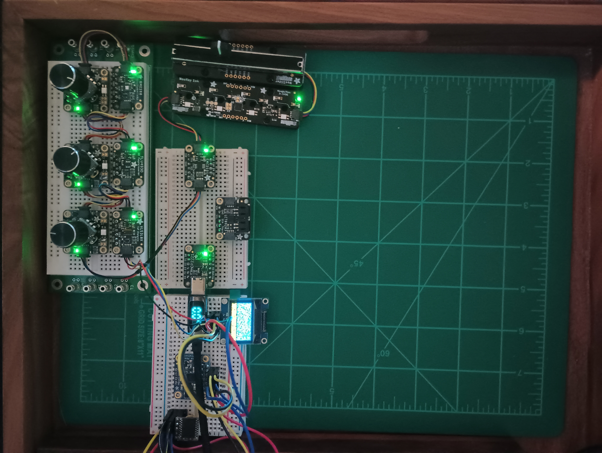
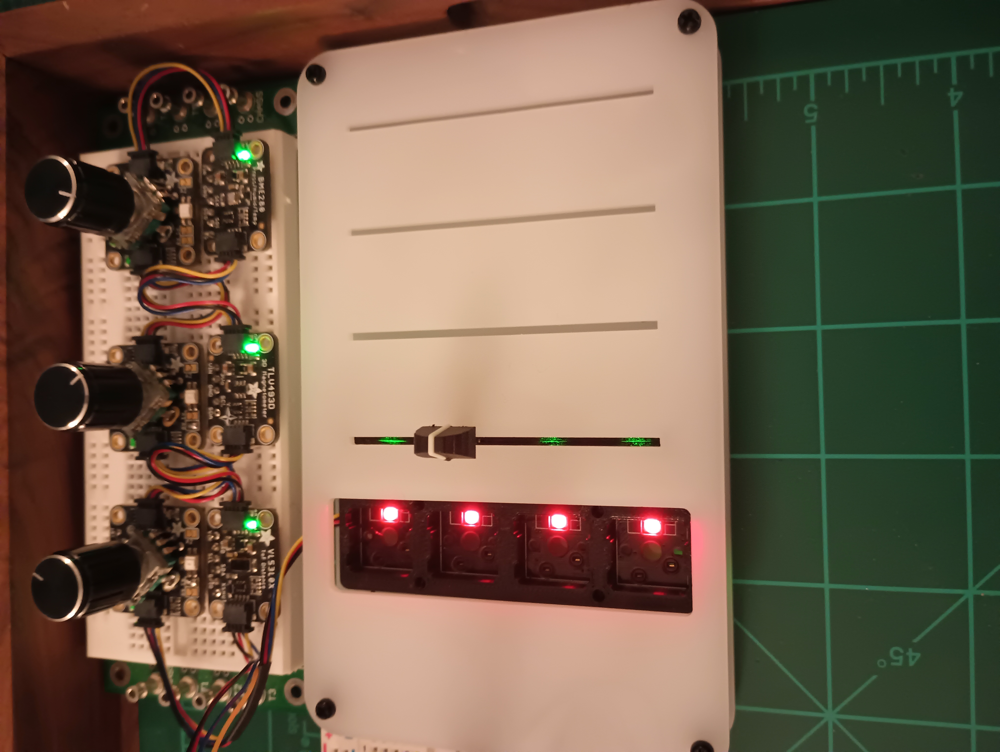
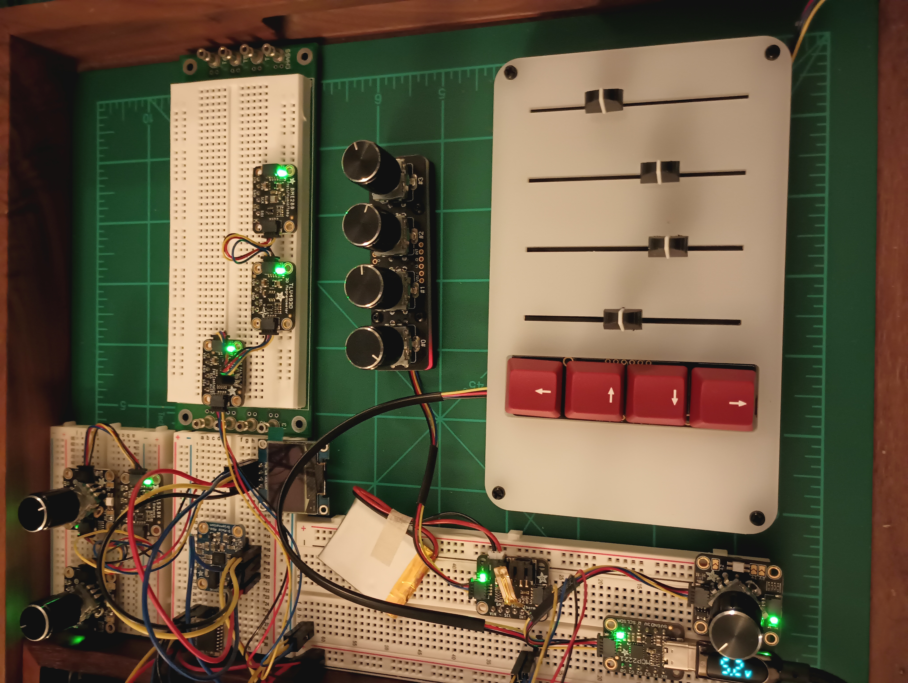
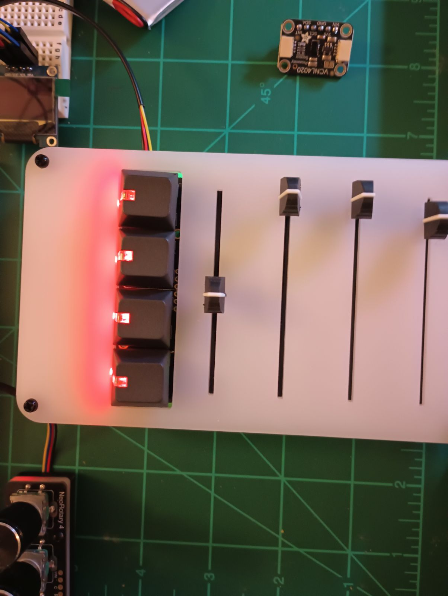
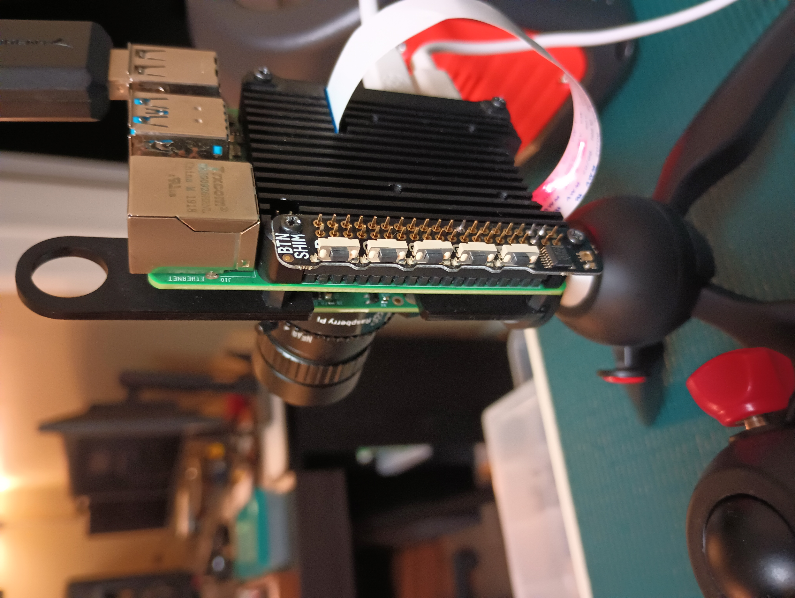
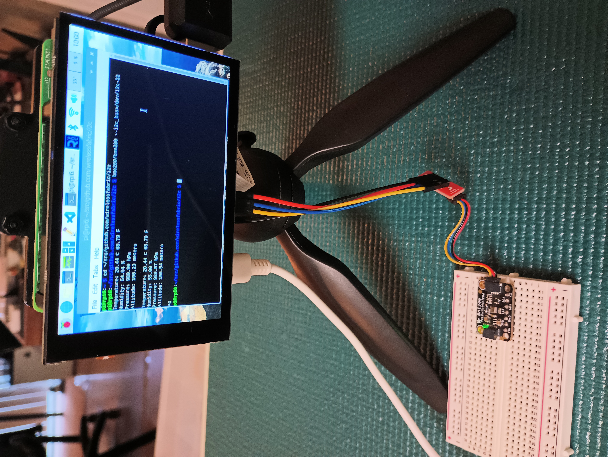

# i2c
Example code, notes, and picture gallery about accessing I2C devices from userspace on Raspberry Pi OS, Ubunutu Linux, macOS, and Windows 11.

All code in this repository is written in C.
All code and notes in this repository are licensed under the MIT license (see [LICENSE](LICENSE)).
```
Adafruit I2C Stemma QT NeoKey 1x4 - Four Mechanical Key Switches with NeoPixels
Adafruit I2C Stemma QT Rotary Encoder Breakout with NeoPixel
Adafruit I2C Stemma QT Quad Rotary Encoder Breakout with NeoPixel
Adafruit I2C Stemma QT NeoSlider Slide Potentiometer with 4 NeoPixels

Adafruit BME280 I2C Temperature Humidity Pressure Sensor
Adafruit BNO055 I2C 9-DOF Absolute Orientation IMU Fusion Breakout
Adafruit BNO085 I2C 9-DOF Orientation IMU Fusion Breakout
Adafruit EMC2101 I2C PC Fan Controller and Temperature Sensor
Adafruit LC709203F I2C LiPoly / LiIon Fuel Gauge and Battery Monitor
Adafruit TLV493D-A1B6 I2C 3D Magnetic Sensor
Adafruit VL53L0X I2C Time of Flight (TOF) Micro-LIDAR Distance Sensor Breakout

Adafruit MCP2221A Breakout General Purpose USB to I2C GPIO ADC

HiLetgo DS3231 I2C High Precision RTC
Hosyond 0.96" OLED I2C 128x64 SSD1306 OLED Screen

Sparkfun Qwiic Breadboard Breakout Adapter
Sparkfun Qwiic Multiport
Sparkfun Qwiic SHIM for Raspberry Pi

Pimoroni Button SHIM for Raspberry Pi
Pimoroni HyperPixel 4.0" Touchscreen

PiSugar 3 UPS HAT

Bus Pirate v3.6 by Dangerous Prototypes
```
















### Installing Linux Packages

Install libi2c-dev, i2c-tools, xz-utils, libusb-dev, and libhidapi-dev.

```
$ sudo apt update
$ sudo apt upgrade
$ sudo apt install libi2c-dev i2c-tools xz-utils
$ sudo apt install libusb-dev libhidapi-dev
```

#### Installing Linux Device Driver Kernel Modules

Raspbian OS Linux kernel provides pre-compiled kernel modules for some I2C devices.

#### Industrial I/O Device (iio)

Notes in tlv493d folder describe installation of vl53l0x-i2c.ko kernel module.

Notes in bno055 folder describe installation of bno055_i2c.ko kernel module.

#### Framebuffer Device (fbdev)

Notes in ssd1306 folder describe installation of ssd1307fb.ko kernel module.

#### USB HID Device (hidapi)

Notes in mcp2221a folder describe removal of hid_mcp2221.ko kernel module, if loaded. The hidapi library depends on hid_generic device driver in Linux kernel.

#### Realtime Clock Device (hwclock)

Notes in rtc-ds1307 folder describe installation of rtc-ds1307.ko kernel module.

#### Installing Adafruit CircuitPython Libraries

Notes in adafruit folder describe installation of Adafruit CircuitPython libraries.

CicruitPython libraries are not required for compilation or execution of C code examples.

CircuitPython libraries may be used to run some Adafruit CircuitPython examples but may require disabling the corresponding device kernel module, if in use.


### Installing macOS Packages

Notes in mcp2221a folder describe installation of hidapi package on macOS.

```
$ brew install hidapi
```

```
$ mkdir ~/src/github.com/libusb
$ cd ~/src/github.com/libusb
$ git clone https://github.com/libusb/hidapi.git
```

### Installing Windows 11 Packages

Notes in mcp2221a folder describe installation of packages on Windows 11.

```
C:> mkdir C:\src\github.com\libusb
C:> cd C:\src\github.com\libusb
C:> git clone https://github.com/libusb/hidapi.git
```


### Cloning the repository
```
$ mkdir -p ~/src/github.com/wirelessfabric
$ cd ~/src/github.com/wirelessfabric
$ git clone https://github.com/wirelessfabric/i2c
```

### Compiling the C code examples on Linux

A simple Makefile invocation at the command prompt compiles all examples.

```
$ cd ~/src/github.com/wirelessfabric/i2c
$ make
```

### Compiling the C code examples on macOS

```
$ cd ~/src/github.com/wirelessfabric/i2c
$ make hid
```

### Compiling the C code examples on Windows 11

```
C:> %comspec% /k "C:\Program Files\Microsoft Visual Studio\2022\Community\VC\Auxiliary\Build\vcvars64.bat"
C:> cd C:\src\github.com\wirelessfabric\i2c
C:> nmake /f Makefile.mak clean
C:> nmake /f Makefile.mak
```

#### Example: Clean executable binaries for all C code examples
```
$ make clean
```

#### Example: Make optimized executable binaries for all C code examples
```
$ make
```

#### Example: Make executable binaries with debug symbols and no optimization for all C code examples
```
$ make dbg=1
```

#### Example: Make binary executable for individual C code examples
```
$ make bme280
$ make emc2101
$ make lc709203f
$ make buttonshim
$ make tlv493d
$ make pisugar3
$ make neokey1x4 
$ make neoslider 
$ make neorotary 
$ make neorotary1x4
$ make ssd1306
$ make mcp2221a
```

### Running I2C example binaries

#### Linux I2C Devices

Example code for Linux I2C devices access the device on the bus from userspace by passing i2c device file descriptors to access functions provided in  i2c_dev_io.c.

```
$ bme280/bme280 --i2c_bus=/dev/i2c-6
Temperature: 20.20 C 68.36 F
Humidity: 56.55 %
Pressure: 985.99 hPa
Altitude: 229.49 meters

^C
```

```
$ bme280/bme280_i2c_hid 
Temperature: 20.80 C 69.44 F
Humidity: 53.48 %
Pressure: 976.89 hPa
Altitude: 307.20 meters

^C
```

```
$ emc2101/emc2101 
External Temperature: Diode Fault (Open Condition)
Internal Temperature:  25.00 C

^C
```

```
$ emc2101/emc2101_i2c_hid
External Temperature: Diode Fault (Open Condition)
Internal Temperature:  20.00 C

^C
```

```
$ lc709203f/lc709203f --i2c_bus=/dev/i2c-4
Cell Voltage:  3.87 V
Current Direction: Auto Mode
Power Mode: Sleep
Temperature Sensing Method: I2C

^C
```

```
$ pimoroni/buttonshim 
Button A: Released
Button B: Released
Button C: Released
Button D: Released
Button E: Released
Button A: Pressed
Button A: Released
Button B: Pressed
Button B: Released
^C
```

```
$ tlv493d/tlv493d 
X:  196.00      Y: -196.00      Z:  -98.00      T:  20.60 C  69.08 F
X:  196.00      Y:  -98.00      Z:    0.00      T:  21.70 C  71.06 F
^C
```

```
$ tlv493d/tlv493d_i2c_hid 
X:  294.00      Y:  -98.00      Z:    0.00      T:  21.70 C  71.06 F
X:   98.00      Y: -196.00      Z:  -98.00      T:  21.70 C  71.06 F
^C
```

```
$ pisugar3/pisugar3 
Power Button: On
Touch Function: Off
Power On When Connected: Off
Output Switch: Off
Charging Switch: Off
Power Supply: Off
Soft Shutdown Sign: Off
Soft Shutdown: Off
Auto Hibernate: Off
Chip Temperature: 3
Battery Capacity 783 mV
Battery Percentage 3 %

^C
```

#### Adafruit Seesaw I2C devices

Example code for Adafruit Seesaw I2C devices access the device on the bus from userspace by passing i2c device file descriptors to access functions provided in i2c_dev_io.c.

```
$ adafruit/neokey1x4 --i2c-addr=0x30 --i2c-bus=/dev/i2c-6
Button A: Released
Button B: Released
Button C: Released
Button D: Released
^C
```

```
$ adafruit/neorotary 
Position: 0
Button: Released
Button: Pressed
Button: Released
Button: Pressed
Button: Released
^C
```

```
$ adafruit/neorotary_i2c_hid
Position: 0
Button: Released
Button: Pressed
Button: Released
Position: 4
Position: 6
Position: 3
Position: 2
^C
```

```
$ adafruit/neoslider 
ADC Status: 0xff
Slider: 0x0286 (646)
Slider: 0x022a (554)
Slider: 0x01d8 (472)
Slider: 0x011c (284)
Slider: 0x019c (412)
^C
```

#### Linux Framebuffer Device (fbdev)

Example code for Linux framebuffer device accesses the SSD1306 device on the I2C bus by mapping the framebuffer memory to userspace using mmap. It relies on ssd1307fb.ko kernel module which is enabled in Raspberry Pi 4 /boot/config.txt as an overlay. Furthermore, it relies on a monochrome 8x8 bit text font provided in fb_font directory to display visible ASCII characters on the framebuffer display.

```
$ ssd1306/ssd1306 
Line Length: 16
Screen Resolution: 128 x 64
Bits Per Pixel: 1
X Offset: 0
Y Offset: 0
Map Size: 1024
^C
```

#### Linux USB HID to I2C Bridge (hidapi)

Example code for USB HID to I2C bridge device scanning I2C devices on MCP2221A I2C bus from usersapce. It uses hidapi function calls. On Linux, it relies on the generic HID device driver, hid_generic, in the kernel.

```
$ mcp2221a/scan_i2c_hid 
i2c_scan(0x0c): ACK
i2c_scan(0x4c): ACK
```

```
C:> mcp2221a\scan_i2c_hid.exe
i2c_scan(0x0c): ACK
i2c_scan(0x4c): ACK
```
